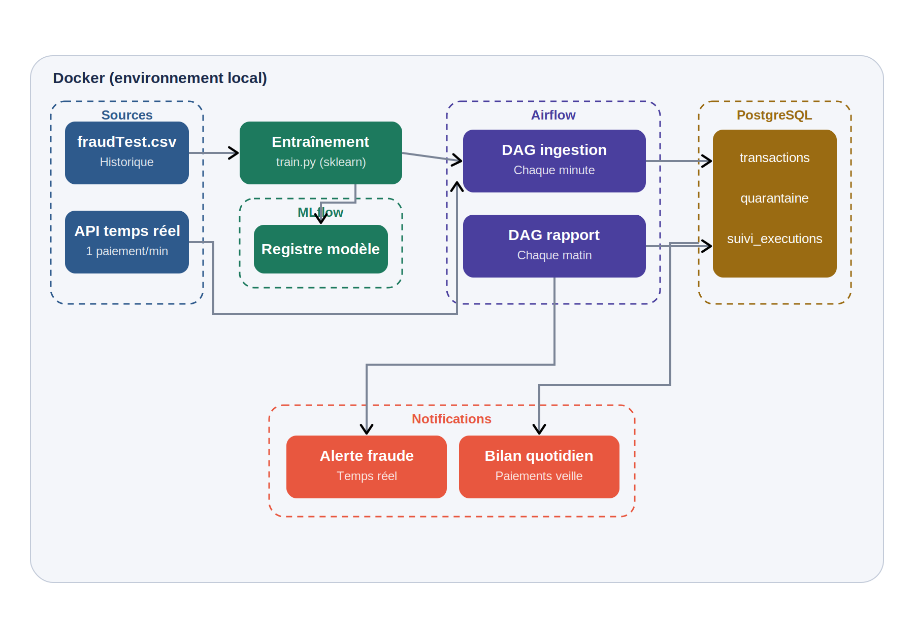
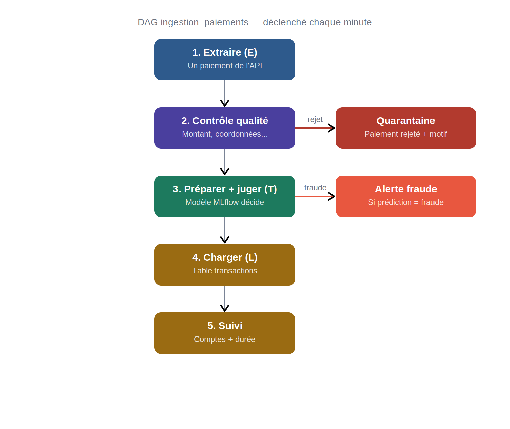

# Détection de Fraude Bancaire en Temps Réel

## Présentation

Ce projet détecte les paiements frauduleux par carte bancaire en temps réel. À partir d'un flux de paiements reçu en continu, le système prépare chaque transaction, la soumet à un modèle de détection, enregistre le résultat et émet une alerte lorsqu'une fraude est repérée. Un bilan quotidien récapitule les paiements et les fraudes de la veille.

L'objectif n'est pas seulement de construire un modèle, mais une chaîne de traitement de données complète, automatisée et surveillée, selon un processus ETL orchestré.

## Démonstration et liens

Démonstration vidéo de l'infrastructure en fonctionnement :

https://github.com/user-attachments/assets/c2e2fc2f-bcc7-406a-8035-3166289e9667

Interfaces locales du projet :

- Tableau de bord de monitoring : `http://localhost:8050`
- Orchestrateur Airflow : `http://localhost:8080`
- Suivi des modèles MLflow : `http://localhost:5000`

## Le besoin métier

L'équipe métier a exprimé deux besoins, auxquels l'infrastructure répond directement :

1. Être alertée dès qu'une fraude est détectée, par une notification.
2. Recevoir chaque matin le bilan des paiements et des fraudes de la veille.

## Architecture

L'ensemble fonctionne en local grâce à Docker. Le parcours de la donnée suit un processus ETL (Extraire, Transformer, Charger), déclenché chaque minute par Airflow.
### Vue d'ensemble

### Le flux ETL, chaque minute

    Sources (historique + API temps réel)
        -> Entraînement du modèle (scikit-learn), rangé dans MLflow
        -> DAG d'ingestion Airflow (chaque minute) : extraction, contrôle
           qualité, prédiction, chargement
        -> Stockage PostgreSQL (transactions, quarantaine, suivi)
        -> Notifications : alerte de fraude et bilan quotidien

Les schémas détaillés (vue d'ensemble et flux ETL) sont disponibles dans le dossier `docs/` et dans la présentation.

## Organisation du dépôt

| Dossier / fichier | Rôle |
|---|---|
| `docker-compose.yml` | Définition des services (PostgreSQL, Airflow, MLflow) |
| `docker-compose.override.yml` | Surcharges locales, connexions, tableau de bord |
| `airflow/` | Image Airflow enrichie (scikit-learn, MLflow) |
| `dags/` | Les deux DAG : ingestion temps réel et rapport quotidien |
| `src/` | Préparation partagée des données (prétraitement) |
| `training/` | Script d'entraînement du modèle |
| `sql/` | Création des bases et des tables métier |
| `dashboard/` | Tableau de bord de monitoring (FastAPI + page web) |
| `docs/` | Schémas d'architecture et captures d'écran |
| `presentation/` | Support de présentation (PDF, PowerPoint) et démonstration |

## Choix techniques et sécurité

- Infrastructure locale reproductible avec Docker ; le passage au cloud reste une évolution possible.
- Bases de données isolées : un compte par base, selon le principe du moindre privilège.
- Données personnelles écartées du modèle (nom, adresse, numéro de carte anonymisé) ; conformité au RGPD.
- Contrôle qualité des données avec mise en quarantaine des paiements douteux.
- Surveillance du pipeline : chaque passage est tracé (volume, rejets, durée de traitement).
- Modèle versionné dans MLflow, rechargeable et réentraînable.

## Résultats

- Précision du modèle : 96 %.
- Rappel (fraudes détectées) : 70 %.
- Pipeline fonctionnant en continu, un paiement traité chaque minute.

## Technologies

Python, Apache Airflow, MLflow, scikit-learn, PostgreSQL, FastAPI, Docker.
