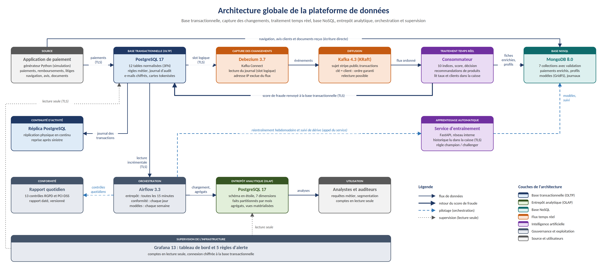

# Architecture de données intégrée OLTP, OLAP et NoSQL - Projet Stripe

Architecture de données complète pour une plateforme de paiement : base transactionnelle, entrepôt analytique et base NoSQL, reliés par un pipeline de capture des changements en temps réel, avec détection de fraude, recommandation de produits, sécurité, conformité et supervision. L'ensemble est mis en œuvre, testé et reproductible sur un poste unique (16 services Docker).



*Rangée du haut : flux temps réel (base transactionnelle, Debezium, Kafka, consommateur, MongoDB). Deuxième rangée : réplica et service d'entraînement. Troisième rangée : traitements par lots orchestrés par Airflow et entrepôt analytique. En bas : supervision par Grafana.*

## Documents

| Document | Contenu |
|---|---|
| [Dossier de projet (PDF)](02_dossier_projet/Dossier_de_projet_Stripe.pdf) | Cahier des charges, conception détaillée, sécurité, intelligence artificielle, résultats et architecture cible (51 pages) |
| [Présentation (PowerPoint)](01_presentation/Presentation_Stripe.pptx) | Support de soutenance de 5 minutes et annexes |
| [Vidéo de démonstration](10_captures/video/pipeline_en_fonctionnement.mp4) | Le pipeline en fonctionnement : infrastructure, flux temps réel, Kafka, MongoDB, Airflow, supervision et intégration des trois bases |
| [Diagrammes](03_diagrammes) | Sept diagrammes (PNG et SVG) et leurs programmes sources |

Vidéo :


https://github.com/user-attachments/assets/0645c691-f8b4-411f-9ec5-bd08b09c1e89


## Livrables

| Livrable | Emplacement |
|---|---|
| Diagramme d'architecture global | [01_architecture_globale.png](03_diagrammes/01_architecture_globale.png) ; dossier, chapitre 2 |
| Diagramme entité-relation de la base transactionnelle | [02_modele_entite_relation.png](03_diagrammes/02_modele_entite_relation.png) ; [04_oltp_postgresql](04_oltp_postgresql) ; chapitre 3 |
| Conception du schéma analytique | [03_schema_etoile.png](03_diagrammes/03_schema_etoile.png) ; [05_olap_entrepot](05_olap_entrepot) ; chapitre 4 |
| Modèle de données NoSQL | [04_modele_nosql.png](03_diagrammes/04_modele_nosql.png) ; [06_nosql_mongodb](06_nosql_mongodb) ; chapitre 5 |
| Architecture du pipeline de données | [05_pipeline.png](03_diagrammes/05_pipeline.png) ; [07_pipeline](07_pipeline) ; chapitre 6 |
| Stratégie d'intégration de l'apprentissage automatique | [07_cycle_modeles.png](03_diagrammes/07_cycle_modeles.png) ; [07_pipeline/ml](07_pipeline/ml) ; chapitre 7 |
| Plan de sécurité et de conformité | [06_securite.png](03_diagrammes/06_securite.png) ; [08_securite_conformite](08_securite_conformite) ; chapitre 8 |
| Requêtes SQL et NoSQL | [09_requetes_metier](09_requetes_metier) ; chapitre 10 |

## Architecture

| Service | Rôle | Version | Port local |
|---|---|---|---|
| Base transactionnelle | PostgreSQL : 12 tables en troisième forme normale, règles métier, journal d'audit | 17 | 5432 |
| Réplica | Réplication physique en continu, reprise après sinistre | 17 | 15433 |
| Debezium (Kafka Connect) | Capture des changements de la table des paiements | 3.7 | 18083 |
| Kafka | Diffusion ordonnée par client, sujet `stripe.public.transactions` à 3 partitions | 4.3 (KRaft) | 29092 |
| Consommateur temps réel | 10 indices, score de fraude, décision, recommandations | Python 3.12 | - |
| MongoDB | Paiements enrichis, profils, registre des modèles, navigation, avis, journaux, documents | 8.0 | 27017 |
| Service d'entraînement | Entraînement, évaluation et suivi des modèles (FastAPI, réseau interne) | Python 3.12 | - |
| Airflow | Alimentation de l'entrepôt, contrôles de conformité, suivi des modèles | 3.3.1 | 18080 |
| Entrepôt analytique | PostgreSQL : schéma en étoile, faits partitionnés par mois, vues matérialisées | 17 | 15434 |
| Grafana | Tableau de bord de supervision et 5 règles d'alerte | 13.2.3 | 13000 |
| Kafbat UI, Adminer, Mongo Express | Interfaces d'administration | - | 8085, 8081, 18082 |

## Organisation du dépôt

```
2_Stripe_Business_Case/
├── 01_presentation/          support de soutenance
├── 02_dossier_projet/        dossier de projet (Word et PDF)
├── 03_diagrammes/            sept diagrammes et leurs programmes sources
├── 04_oltp_postgresql/       schéma, règles métier, index, référentiels, rôles, réplication
├── 05_olap_entrepot/         schéma en étoile, partitions, index, vues, suivi, rôles
├── 06_nosql_mongodb/         collections et validation, index, comptes, tests de validation
├── 07_pipeline/
│   ├── airflow/              image Airflow du projet
│   ├── dags/                 chaînes etl_entrepot, controles_conformite, suivi_modeles
│   ├── debezium/             configuration documentée du connecteur
│   ├── generateur/           générateur de données (historique et temps réel)
│   └── ml/                   indices, entraînement, consommateur, service, suivi
├── 08_securite_conformite/   certificats, rapports quotidiens, tests d'accès et de chiffrement
├── 09_requetes_metier/       requêtes SQL et NoSQL des dix-sept questions
├── 10_captures/              captures d'écran et vidéo de démonstration
├── 11_supervision/           tableau de bord, sources de données et règles d'alerte Grafana
├── docker-compose.yml        description des seize services
└── .env.example              modèle des variables d'environnement, sans secret
```

## Résultats mesurés

| Mesure | Résultat |
|---|---|
| Latence médiane du flux temps réel (enregistrement, notation, écriture) | Environ 540 ms |
| Modèle de fraude : AUC sur les 20 % de paiements les plus récents, jamais vus | 0,99 |
| Modèle de recommandation : réussite dans les 5 premières recommandations | 52,3 % (8,2 % pour la seule popularité) |
| Tests automatisés des droits d'accès | 42 sur 42 conformes |
| Tests automatisés du chiffrement | 3 sur 3 conformes |
| Tests des règles de validation MongoDB | 14 sur 14 conformes |
| Contrôles quotidiens de conformité et de disponibilité | 13 sur 13 conformes |

## Sécurité et conformité

- Chiffrement TLS 1.3 obligatoire vers la base transactionnelle, avec vérification complète du serveur ; adresses e-mail chiffrées ; cartes remplacées par un jeton.
- Contrôle d'accès par rôles : 11 rôles et un compte par programme, droits définis jusqu'à la colonne (PostgreSQL) et à la collection (MongoDB) ; aucune suppression possible pour les comptes de service dans la base transactionnelle et MongoDB.
- Journal d'audit non modifiable, copié dans l'entrepôt et réservé au rôle d'auditeur.
- Minimisation (aucune donnée personnelle directe dans l'entrepôt, adresse IP exclue du flux), conservation des journaux limitée à 90 jours.
- Rapport de conformité quotidien (RGPD, PCI-DSS), produit par Airflow dans `08_securite_conformite/rapports`.
- Secrets hors du dépôt : le fichier `.env` et les clés privées (`*.key`) sont exclus par `.gitignore`.

## Déploiement

Prérequis : Docker Desktop (Docker Compose 2) et PowerShell 7.

Les scripts de création des bases, des rôles, des comptes et des collections s'exécutent automatiquement au premier démarrage, depuis les dossiers `04_oltp_postgresql`, `05_olap_entrepot` et `06_nosql_mongodb`. Le déploiement comprend six étapes.

**1. Secrets et certificats.** Le fichier `.env` est créé à partir de `.env.example`, chaque valeur `a_definir` étant remplacée par un mot de passe aléatoire. Les certificats TLS sont générés par un conteneur Python temporaire :

```powershell
docker run --rm -v "${PWD}\08_securite_conformite\certificats:/certificats" python:3.12-slim sh -c "pip install --quiet --root-user-action=ignore cryptography==50.0.2 && python /certificats/generer_certificats.py"
```

**2. Services permanents.**

```powershell
docker compose build
docker compose up -d
```

**3. Historique et entraînement initial des deux modèles.**

```powershell
docker compose run --rm generateur historique
docker compose run --rm entrainement entrainement.py --initialiser
docker compose run --rm entrainement entrainement_recommandations.py --initialiser
```

**4. Connecteur de capture des changements** (enregistrement auprès de l'API de Kafka Connect) :

```powershell
$config = (Get-Content 07_pipeline\debezium\connecteur_transactions.json -Raw | ConvertFrom-Json).config
Invoke-RestMethod -Method Put -ContentType "application/json" -Uri http://localhost:18083/connectors/stripe-cdc-transactions/config -Body ($config | ConvertTo-Json)
```

**5. Flux temps réel.**

```powershell
docker compose --profile pipeline up -d consommateur generateur
```

**6. Chaînes Airflow.** Les chaînes `etl_entrepot`, `controles_conformite` et `suivi_modeles` sont activées depuis l'interface d'Airflow ou par `airflow dags unpause`. Les identifiants de l'interface sont générés par Airflow dans `/opt/airflow/simple_auth_manager_passwords.json.generated`.

## Interfaces

| Interface | Adresse |
|---|---|
| Airflow | http://localhost:18080 |
| Grafana | http://localhost:13000 |
| Kafbat UI (Kafka) | http://localhost:8085 |
| Adminer (PostgreSQL) | http://localhost:8081 |
| Mongo Express (MongoDB) | http://localhost:18082 |

## Limites et architecture cible

L'environnement de démonstration fonctionne sur un poste unique, avec un rythme de paiements volontairement accéléré, une bascule manuelle vers le réplica et un chiffrement TLS limité à la base transactionnelle. L'architecture cible (services gérés sur trois zones de disponibilité, Kafka à trois courtiers, MongoDB réparti, Kubernetes et Terraform) est décrite au chapitre 11 du dossier de projet.

---

Aïcha Fathellah, octobre 2026
